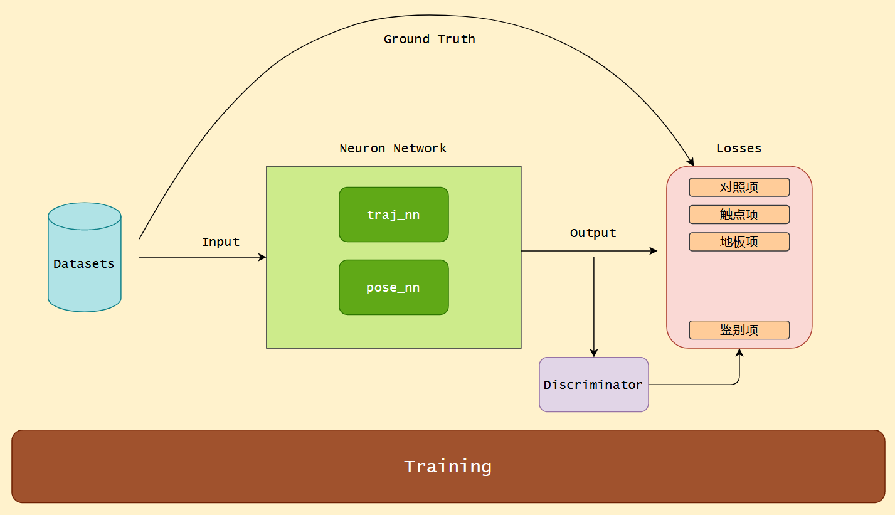

# 总体框架

# Datasets
- How to utilize multi-view of our dataset?
- Why choose 2D-Keypoints as input?
    - Why do not choose Feature-map as input?
      Answer: 3D 数据集不充分, 背景干扰比较严重.
    - Why do not choose 2D Heat-map as input?
      Answer: 输入为 2D map, 数据量会比较大;
- How to make use of temporal info in 2D Keypoints detection?

# Input
- How to Integrate other features into 2D keypoints?
  say: concat foot contact point to 2D keypoints;

# Neuron Network
- How to incorporate Kinematic / Dynamic Prior into NN?
- Could we regress traj from 2D keypoints?
- How to speedup Transformer? Deformable DETR?

# Output

# Losses
- How to get 2D Projection Loss?
- How to train Discriminator?
- How to get Discriminator Loss?
- How to use SMPL to unify various Datasets?
- How to use skeleton?

# Training Method
- How to pre-train Transformer? "fill in the blanks"?
- How to Augment?

